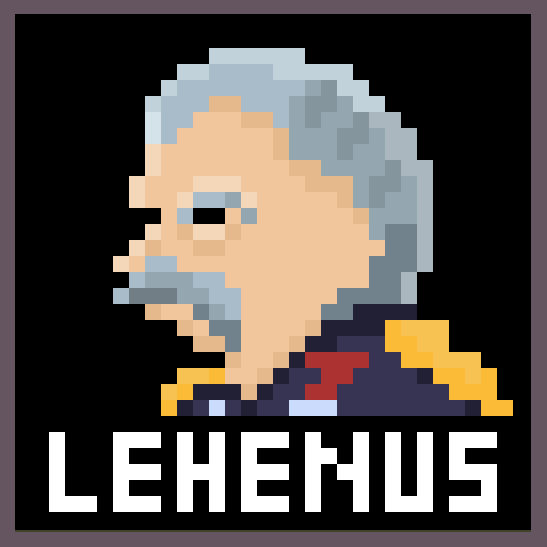

 

# 세계관
텔폰 동부어로 광성, 미네크로스 행성에는 몇 년 전부터, 불길한 기운이 감돌기 시작했습니다.  
수출 협상국들의 레드스톤 수출 금지령으로 시작된 레드스톤 대공황은 텔폰 대륙을 넘어 이그제카 대륙까지 확산되고 있습니다.  
이에 극단적인 채굴을 주장하는 채광파 일부 세력은 구이트센 황실을 무너뜨리고,  
초대 황제의 이름을 딴 직위, '르헨'을 만들어 모든 권력을 가진 최고 지도자로 떠받들고 있습니다.  
구이트센 제국 주위의 국가들은 대공황에 허덕이며 걷잡을 수 없이 퍼지고 있는 채광파의 검은 손길을 막고자 합니다. 

**대전쟁과 식민지 행정, 대공황에 대한 승리의 갈림길에서, 우리는 국가의 미래를 결정해야만 합니다.**

[for MUC.](https://discord.gg/KrDvgQHHYE)

# 직접 서버 설정하기
### ${\textsf{\color{red}현재 서버 개발이 완료되지 않았으니, 관련 지식 없이 서버 구동을 시도하지 마십시오.}}$
1. 마인크래프트 서버를 구동할 컴퓨터와, 디스코드 서버, 그리고 모든 Gateway Intent가 활성화되어 있는 디스코드 봇이 필요합니다.
2. 플러그인을 마인크래프트 서버에 적용하세요.
3. 오류로 인해 서버가 종료될 것입니다.
4. 플러그인 폴더 안에 있는 "Heracles" 폴더 안의 config.yml 파일에 들어가세요.
5. 1번에서 만든 디스코드 봇의 토큰과, 여러 채널(관리자 채널, 채팅 채널, 사건 채널)의 ID, 웹후크의 URL(앞에서 설정한 채팅 채널에 웹후크를 생성하십시오), 메시지 형식을 입력하세요.
6. 다시 서버를 구동하십시오.
7. 웹 페이지가 구동되며, 디스코드 봇이 작동할 것입니다.
8. 마인크래프트 서버 접속을 위해 포트를 개방해야겠지만, 웹 페이지 접속을 위해서도 포트를 개방할 필요가 있습니다.
